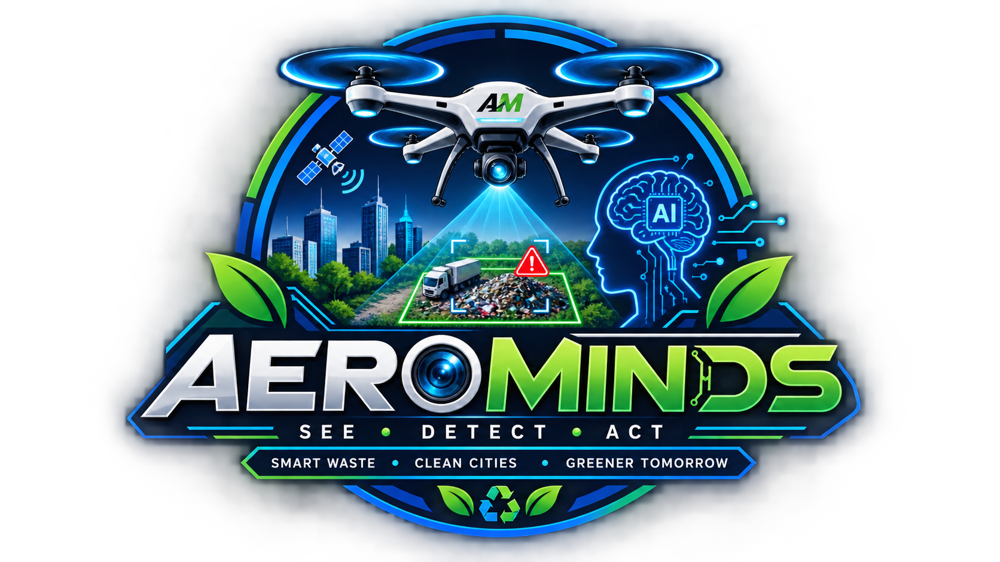

<div align="center">
  
  <br/>
  <h1>AeroMinds</h1>
  <h3>AI-Powered Aerial Waste Intelligence</h3>
  
  <p>
    <b>Detect • Assess • Respond</b><br/>
    Autonomous aerial intelligence for smarter urban sanitation and real-time environmental protection.
  </p>

  <p>
    
    
    
    
  </p>
</div>

---

## 🌍 The Mission
AeroMinds transforms raw aerial drone footage into actionable environmental intelligence. By leveraging state-of-the-art YOLOv8 object detection, AeroMinds autonomously identifies illegal dumping sites, categorizes their severity, and streamlines the response pipeline to keep cities clean.

## ✨ Key Features
- **Live Intelligence Dashboard**: A premium, dark-mode command center for monitoring urban sanitation.
- **Aerial Image & Video Inference**: Drag-and-drop support for high-resolution images and drone flyover videos.
- **Severity Assessment Engine**: Automatically calculates waste coverage percentages, cluster counts, and assigns actionable severity scores (HIGH, MEDIUM, LOW).
- **Automated Incident Pipeline**: Tracks detections through a visual timeline (DETECTED → PENDING → ASSIGNED → CLEARED).
- **Hardware Accelerated**: Optimized PyTorch pipeline utilizing CUDA 12.1 for lightning-fast video frame processing.

## 🚀 Quick Start (Local Development)

1. **Clone the repository**
```bash
git clone https://github.com/Roushan345/AeroMinds.git
cd AeroMinds
```

2. **Set up the environment**
```bash
python -m venv .venv
source .venv/Scripts/activate  # Windows
# source .venv/bin/activate    # Mac/Linux
pip install -r requirements.txt
```

3. **Launch the Command Center**
```bash
streamlit run streamlit_app.py
```
> The dashboard will automatically launch at `http://localhost:8501`.

## 🧠 Model Architecture
AeroMinds uses a fine-tuned **YOLOv8** model (`models/aerominds_dumping_v2.pt`) explicitly trained on aerial imagery to identify illegal waste dumping. The model operates with a baseline 40% confidence threshold and features optimized Non-Maximum Suppression (NMS) for dense clusters.

## ⚠️ Prototype Limitations
- **Synchronous Video Processing:** The current Streamlit application processes video frames synchronously on the main thread, which blocks the UI for large files. A production deployment would require an asynchronous task queue (e.g., Celery).
- **Geospatial Disconnect:** The prototype currently hardcodes location metadata (`Zone A`). Real-world application requires extracting GPS telemetry from drone EXIF data or SRT subtitle files to accurately plot detections on a map.
- **Data Persistence:** The local SQLite database (`data/aerominds.db`) will be wiped upon Docker container restarts unless external volumes are configured.
- **Small Object Detection:** The YOLOv8 Nano model is optimized for speed but struggles with detecting micro-debris from high altitudes. Slicing Aided Hyper Inference (SAHI) is recommended for production.

## 📊 Model Performance & Edge Cases
Detailed validation results are available in the [results/detect/val](results/detect/val/) directory.

### ✅ Successful Cases (True Positives)
1. **High-Contrast Solid Dumping Masses:** The model bounds large, concentrated piles of illegal waste that heavily contrast with natural environments (e.g., green grass or dark soil). Evidence: [`val_batch0_pred.jpg`](results/detect/val/val_batch0_pred.jpg).
2. **Scattered Roadside Debris:** The model successfully groups close-proximity scattered waste along dirt roads or pathways into distinct clusters. Evidence: [`val_batch2_pred.jpg`](results/detect/val/val_batch2_pred.jpg).
3. **Unnatural Geometric/Industrial Waste:** Construction materials and metal sheets are easily isolated because their geometric edges do not mimic organic terrain. Evidence: High precision on the [`BoxPR_curve.png`](results/detect/val/BoxPR_curve.png).

### ❌ Failure Cases (False Positives/Negatives)
1. **False Positive - Natural Terrain and Rocks:** Large, light-colored boulders, patchy dry brush, or sun-glare spots are occasionally flagged as waste because their high-altitude texture resembles scattered debris. Evidence: Background-to-class error rate in [`confusion_matrix.png`](results/detect/val/confusion_matrix.png).
2. **False Negative - Tree Canopy Occlusion:** Small clusters of waste (micro-debris) or dumping sites heavily cast in shadows/obscured by tree canopies are sometimes missed by the Nano model. Evidence: Compare predicted vs. ground truth in [`val_batch0_pred.jpg`](results/detect/val/val_batch0_pred.jpg) and [`val_batch0_labels.jpg`](results/detect/val/val_batch0_labels.jpg).

## 🐳 Deployment (Docker / HuggingFace Spaces)
This project is configured out-of-the-box for containerized deployment.
```bash
docker build -t aerominds .
docker run -p 7860:7860 aerominds
```
*(Runs the Flask fallback server on port 7860)*

---
<div align="center">
  <i>Built to keep our environment clean, one flight at a time.</i>
</div>
